## JukeBox

JukeBox application is intended to maintain a catalogue of music albums by various musicians. The
application should also maintain information about musicians, music and the relationships between
musicians and music (i.e, who has sung/played which album). You are required to implement a set of
demonstrable REST APIs that can be consumed by any UI/client application to retrieve information
about artists and music albums & also to add new music albums, artist details.

### Setup Guide

1. Make sure you have go installed into your system, otherwise check this [https://go.dev/doc/install](https://go.dev/doc/install)
2. Clone the git repo
3. Install required packages with this command at root directory of this project
    ```bash
    go mod tidy
    ```
4. Apply database migrations with this command at root directory of this project
    ```bash
    go install github.com/pressly/goose/v3/cmd/goose@latest
    goose -dir migrations sqlite3 "jukebox.db" up
    ```
    - If your go bin is not added into your PATH so make sure to add that, so that you can access this goose command into your command line
5. Create a `.env` file containing these parameters
    ```.env
    HOST=<host>
    PORT=<port>
    ```
6. Run server with this command
    ```bash
    go run .
    ```

### Demo API Screenshots

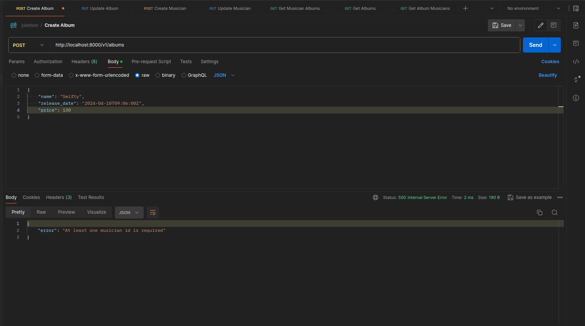
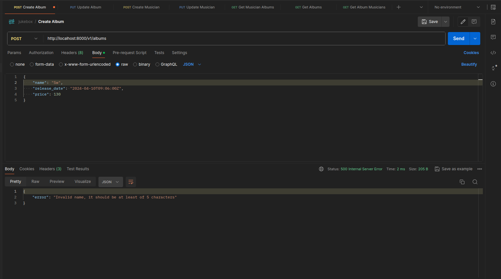
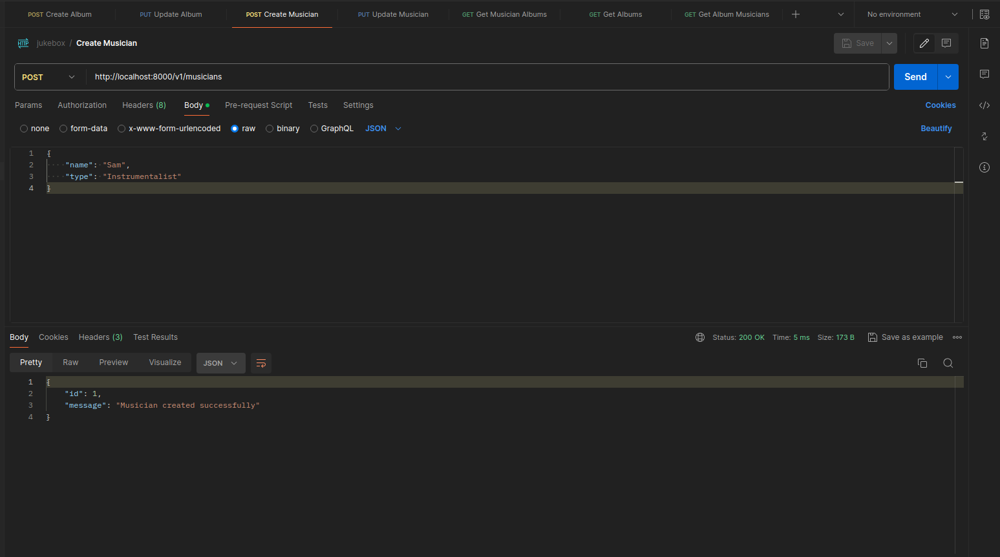
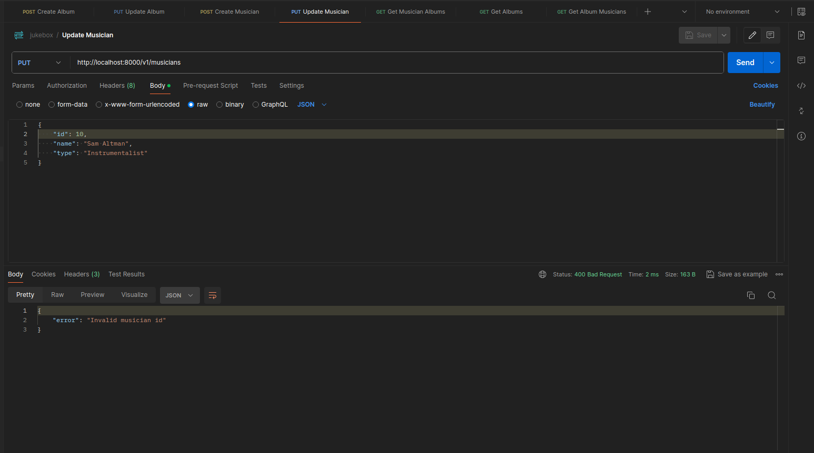
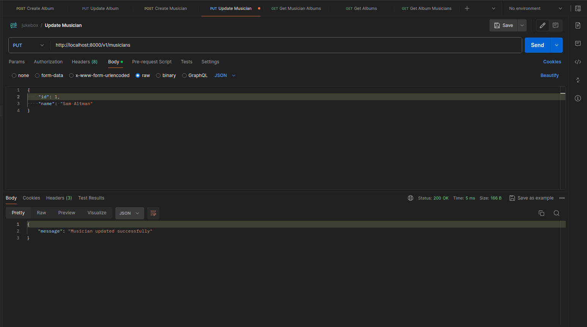
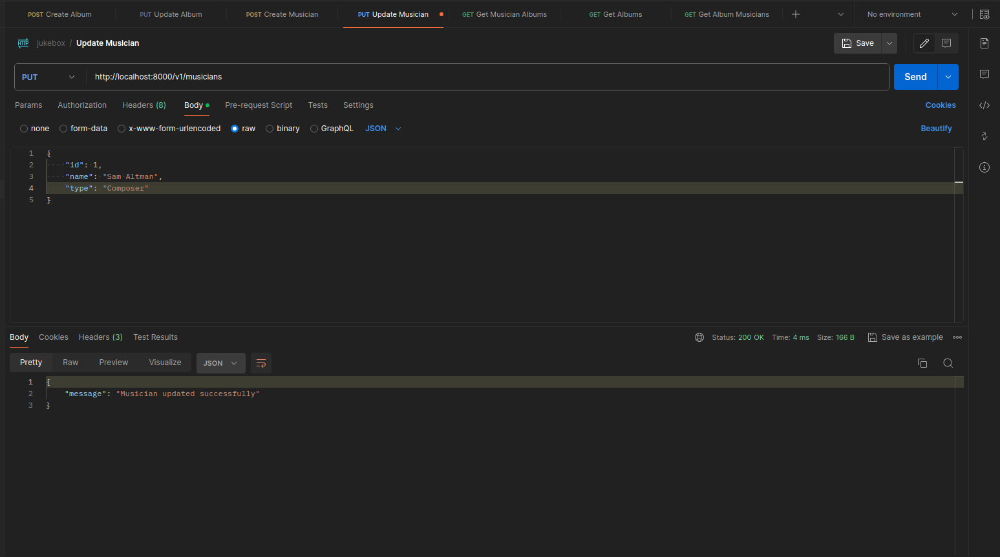
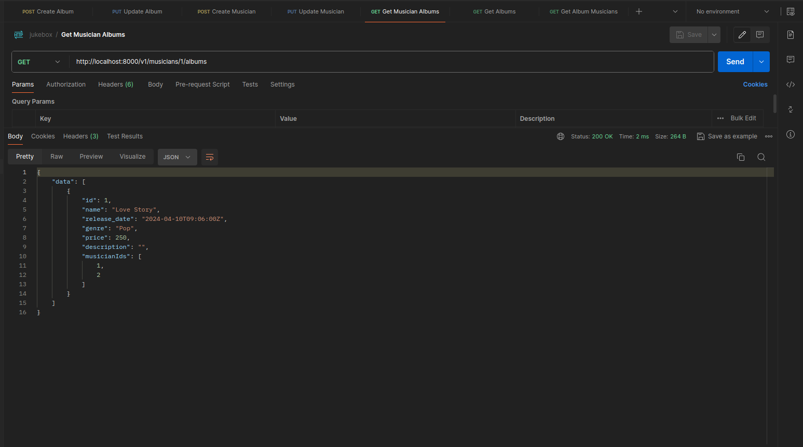
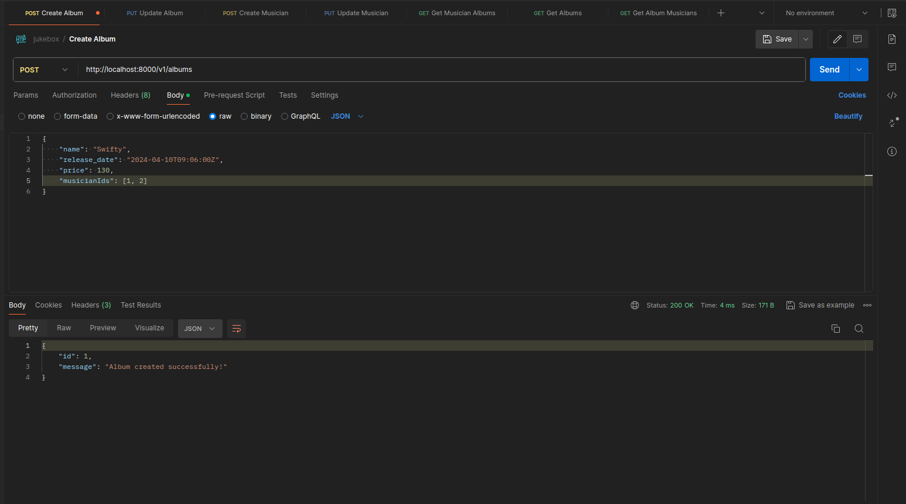
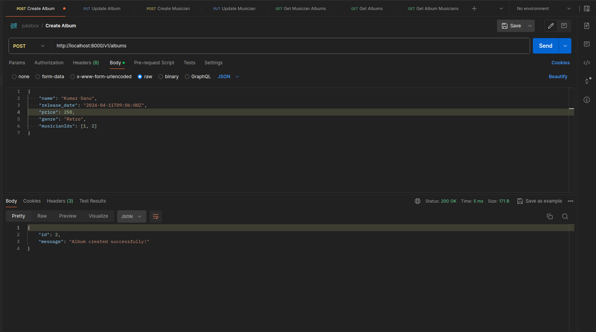
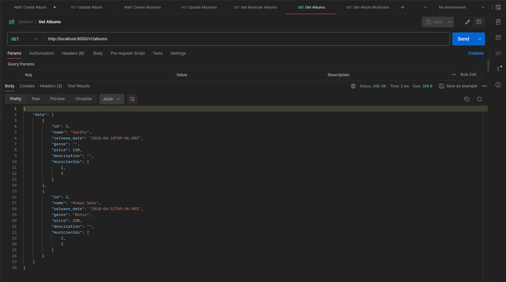
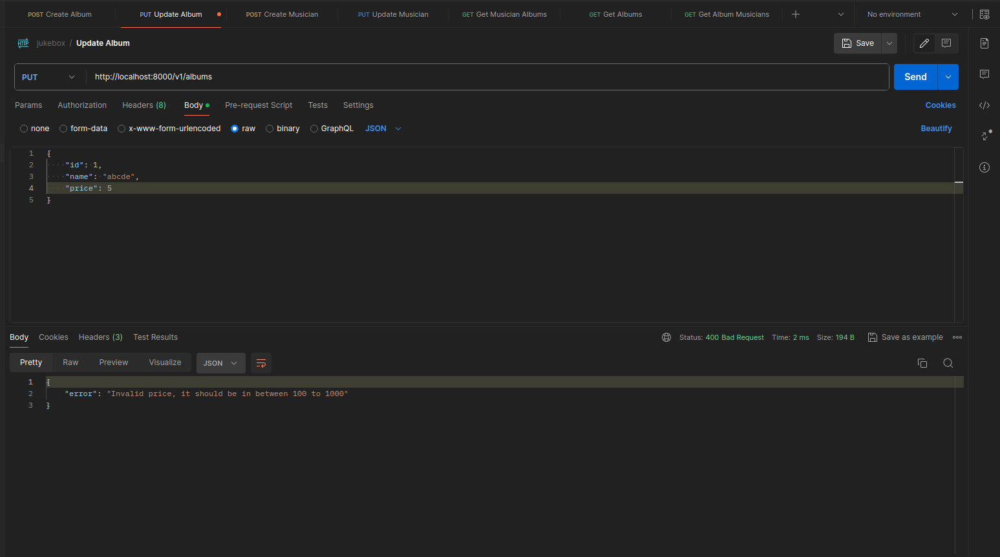
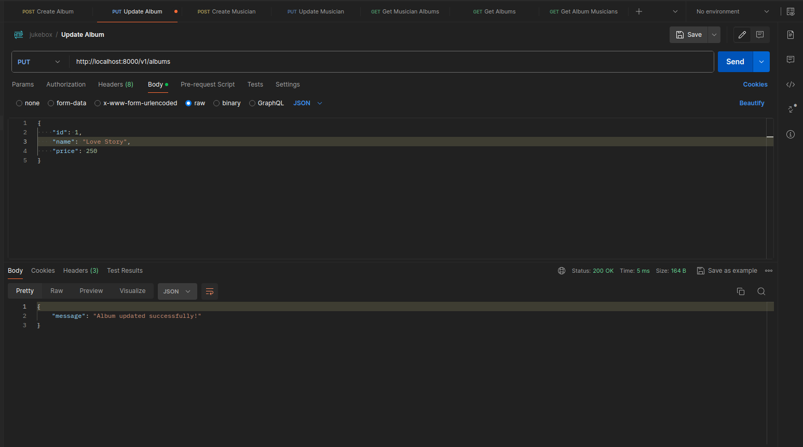
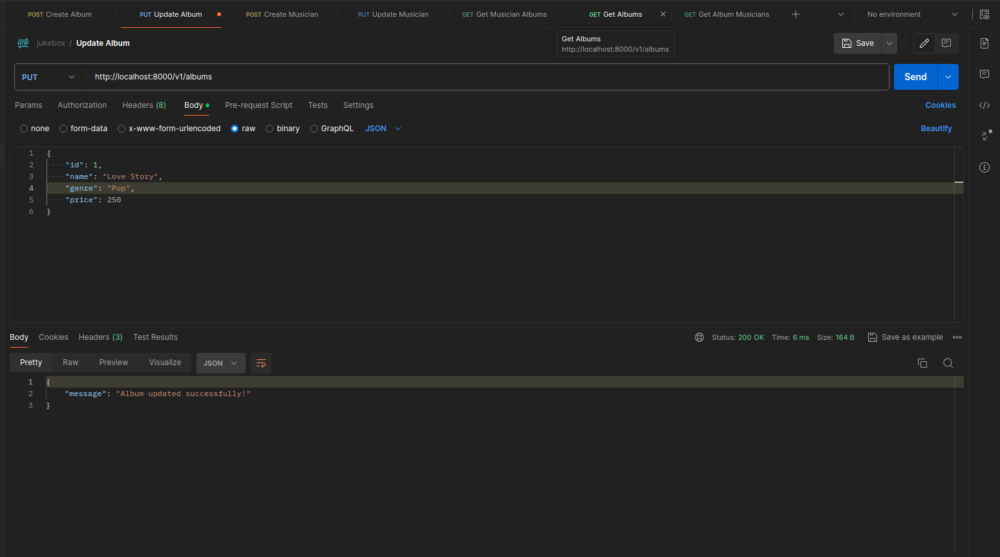
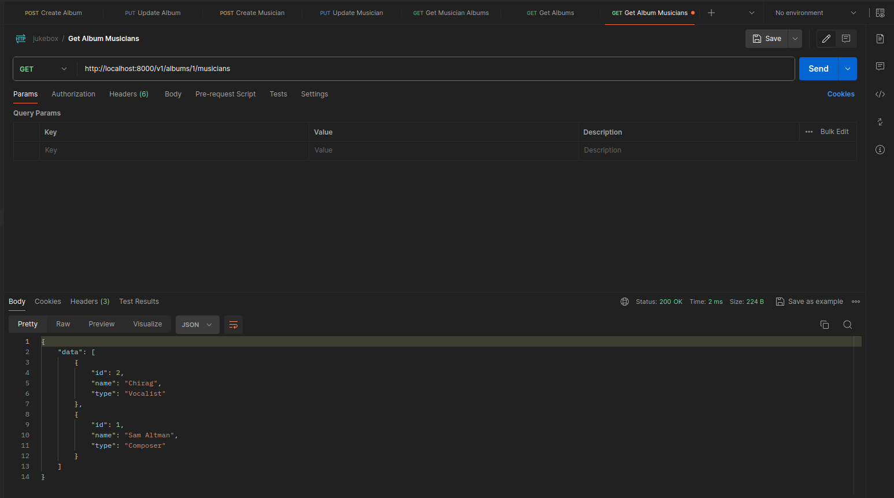
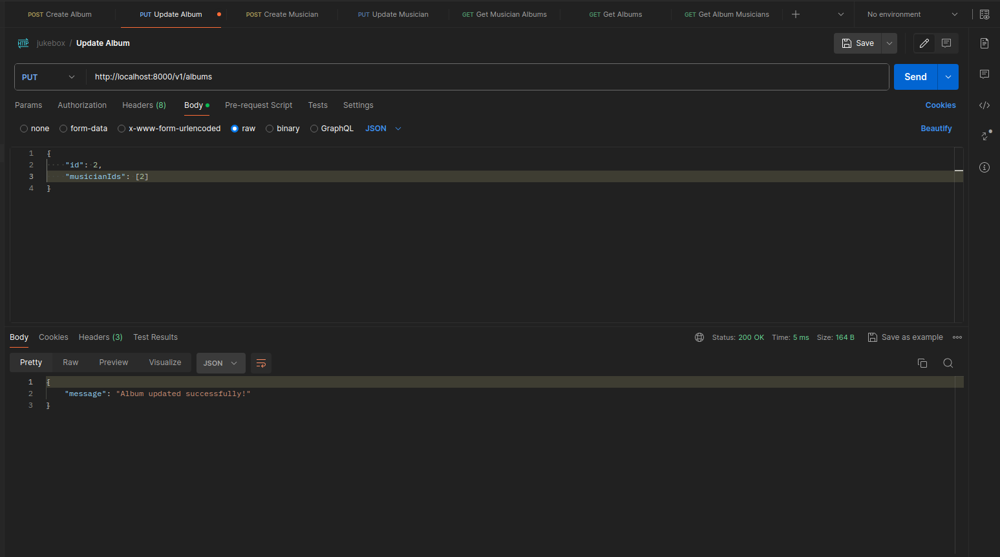
